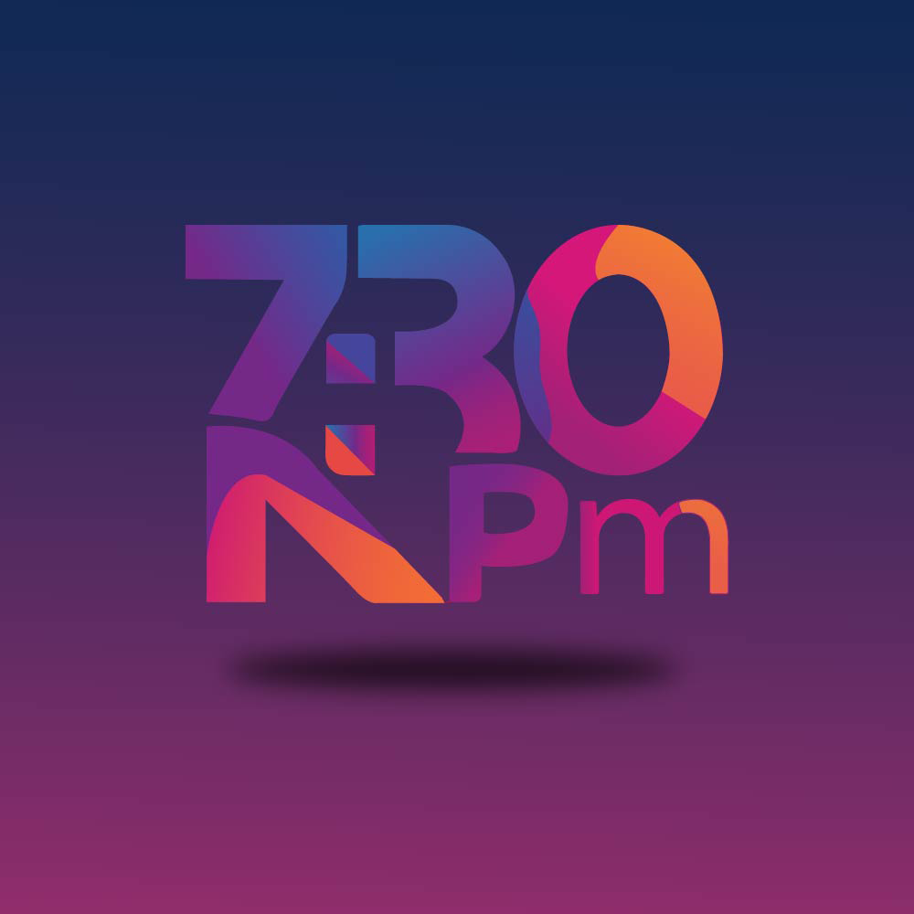

# faiharsportfolio.com
Portfolio of Faihars Bin Iqbal showcasing creative graphic design, branding, social media content, print layouts, and presentation designs. Highlighting skills and projects visually.
<!DOCTYPE html>
<html lang="en">
<head>
<meta charset="UTF-8">
<meta name="viewport" content="width=device-width, initial-scale=1.0">
<title>Faihars bin Iqbal - Portfolio</title>

</head>
<body>

<header>

<h1>Faihars bin Iqbal</h1>
<h2>Graphic Design & Data Entry Specialist</h2>
<nav>
  <a href="#about">About</a>
  <a href="#works">Works</a>
  <a href="#skills">Skills</a>
  <a href="#contact">Contact</a>
</nav>
</header>

<!-- About Me -->
<section id="about">
<h3>About Me</h3>

Hi, I'm <b>Faihars Bin Iqbal</b> — a passionate <b>Graphic Designer</b>. I create clean, modern and conversion-focused designs that help brands tell their story visually. Since 2022, I’ve been consistently delivering high-quality results with attention to detail and client satisfaction.

Services I love: logo & branding, social media creatives, posters/banners, thumbnails, print layouts, and presentation design.

</section>

<!-- Works -->
<section id="works">
<h3>My Works</h3>

Some categories I work on:

  <!-- Logo Design -->
  

    Logo Design
    

      
Clean, memorable logos for brands and businesses.

      
      
      
      
      
      
      
    

  

  <!-- Social Media -->
  

    Social Media
    

      
Posters, banners, ad creatives optimized for reach.

      
      
      
      
      
    

  

  <!-- Print Design -->
  

    Print Design
    

      
Flyers, brochures, business cards, packaging & more.

      
      
      
      
      
    

  

  <!-- Presentation -->
  

    Presentation
    

      
Professional slides for business and academics.

      
      
      
      
      
    

  

</section>

<!-- Skills -->
<section id="skills">
<h3>Skills</h3>
<ul class="skills-list">
  <li>Adobe Photoshop</li>
  <li>Adobe Illustrator</li>
  <li>Adobe InDesign</li>
  <li>CorelDRAW</li>
  <li>Canva</li>
  <li>Logo Design</li>
  <li>Branding & Identity</li>
  <li>Business Card & Stationery</li>
  <li>Banner / Poster / Flyer</li>
  <li>Social Media Post Design</li>
  <li>Thumbnail Design</li>
  <li>Brochure & Catalogue</li>
  <li>Photo Editing & Retouching</li>
  <li>Background Removal</li>
  <li>Color Correction</li>
  <li>Vector Illustration</li>
  <li>Typography</li>
  <li>Presentation Design</li>
  <li>Infographic Design</li>
  <li>Print Layout</li>
  <li>Mockup & Product Showcase</li>
  <li>Creative Layout & Ads</li>
  <li>File Prep for Print</li>
</ul>
</section>

<!-- Contact -->
<section id="contact" class="contact">
<h3>Contact</h3>

Email: <a href="mailto:biniqbalfaihars@gmail.com">biniqbalfaihars@gmail.com</a>

Phone: <a href="tel:01889840342">01889840342</a>

Location: Chittagong, Bangladesh

</section>

<footer>
© 2025 Faihars bin Iqbal — All Rights Reserved
</footer>

<!-- Lightbox -->

  

</body>
</html>
